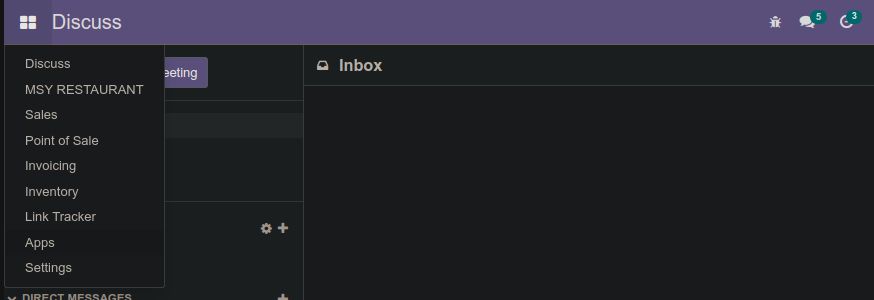
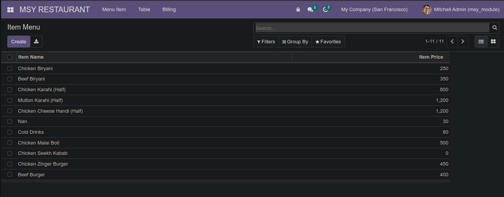
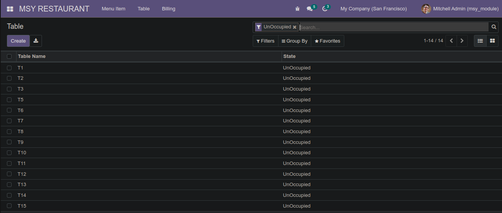
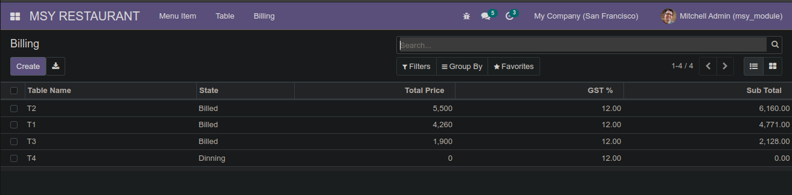
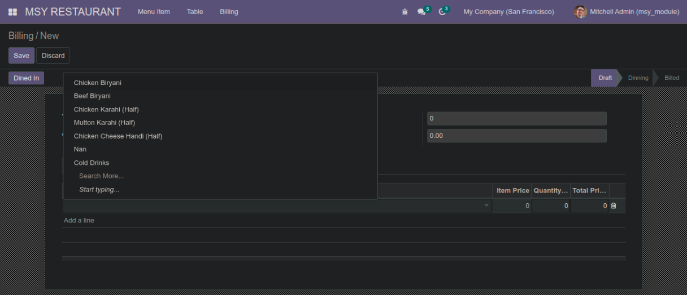
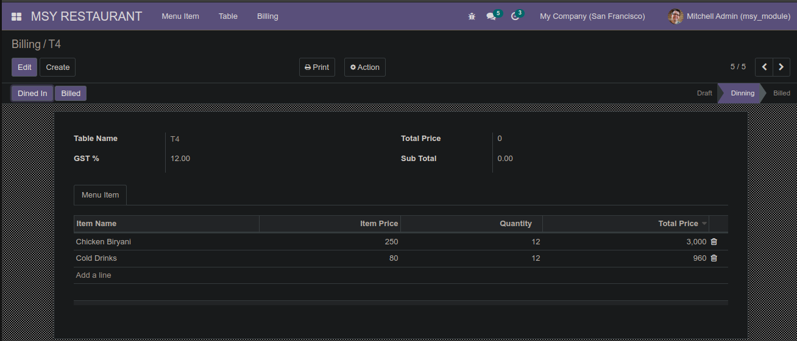
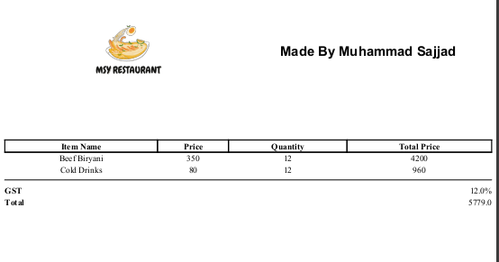

# Odoo-v14-15

<br>
<h2>What Is Odoo</h2>
<h3>Odoo is a suite of web based open source business apps.</h3>

The main Odoo Apps include an <a href="https://www.odoo.com/page/crm">Open Source CRM</a>,
<a href="https://www.odoo.com/page/website-builder">Website Builder</a>,
<a href="https://www.odoo.com/page/e-commerce">eCommerce</a>,
<a href="https://www.odoo.com/page/warehouse">Warehouse Management</a>,
<a href="https://www.odoo.com/page/project-management">Project Management</a>,
<a href="https://www.odoo.com/page/accounting">Billing &amp; Accounting</a>,
<a href="https://www.odoo.com/page/point-of-sale">Point of Sale</a>,
<a href="https://www.odoo.com/page/employees">Human Resources</a>,
<a href="https://www.odoo.com/page/lead-automation">Marketing</a>,
<a href="https://www.odoo.com/page/manufacturing">Manufacturing</a>,
<a href="https://www.odoo.com/#apps">...</a>
  

<h2>The Main Architecture of Odoo in a Nutshell:</h2>
1. Backend: Postgresql, Python 3 (Odoo 11.0 and up), XML
<br>
2. Frontend: HTML, Javascript, QWeb (proprietary), XML
<br>
3. Odoo follows a MVC architecture:

Odoo Apps can be used as stand-alone applications, but they also integrate seamlessly so you get
a full-featured <a href="https://www.odoo.com">Open Source ERP</a> when you install several Apps.

<h3>Writing code with Python</h3>
The primary programming language of Odoo is Python. Like the other technologies underlying Odoo, the Python language is open source and runs on all the major contemporary operating systems.

<h3>Following the Model-View-Controller design</h3>
Odoo is built upon a Model-View-Controller (MVC) architecture. One of the primary goals of this architecture is to separate the visual display of the information from the business rules and management of the underlying data.

<h3>Designing models</h3>
he model is essentially the data that makes up your Odoo installation, which is stored in the PostgreSQL database. Odoo is unique in that database structures are typically defined by the Odoo modules at the time they are installed.

<h3>Rendering views</h3>
Each view in Odoo is defined in XML documents. The Odoo framework is responsible for rendering these view files in a web browser. 

<h3>Authoring controllers</h3>
The controller component of the architecture is where the business logic and workflow rules of the Odoo application are applied

<br>


<h2>How To Get My Custom Addons run your OS</h2>
You simply have to add custom addons path in our odoo.conf in your Odoo #version directory and paste my custom Addons folder in that path and simply run the module


# MSY-RESTAURANT-ODOO

## Setup

``` terminal
git clone https://github.com/sajjad-yousuf-96/MSY-RESTAURANT-ODOO.git

cd MSY-RESTAURANT-ODOO

run your odoo localhost:8069/web if you have configure different localhost then
localhost:####/web

Create Database

Go to Apps Menu Search 'MSY RESTAURANT' and install module
```

## How To Use
Click on MSY RESTAURANT from main menu


By Clicking on Menu Item


By Clicking on Table


By Clicking on Billing


## How To Create Billing
SELECT TABLE FROM TABLE DROP DOWN

Open Billing Menu --> Create
Click on Add line at bottom line
You will se the list of menu

Item price will come automatically 

Add Quantity And then total price will automatically calculated

After menu is added click on dine in Button so that table will shift to Occupied and will not visible for selection.

When You want to complete bill 



Click on Billed Button
Then Table will move to unoccupied state and will be avaliable for selection and bill will be printed.


